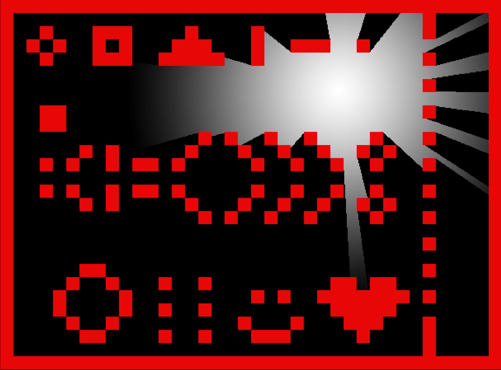

# Light-Polygon-with-Raycasting
A simple simulation visualizing the creation of light polygons by casting rays from the light source.

Written using [olcPixelGameEngine](https://github.com/OneLoneCoder/olcPixelGameEngine).

Run the project using `make`. For the optimized version, run `make release`. 

Huge thanks to [javidx9](https://www.youtube.com/c/javidx9) for inspiration.
